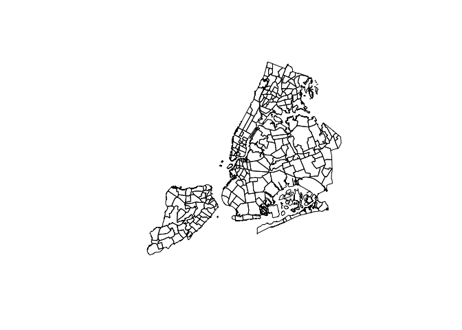

Custom NYC Shapefile
================

Download the most recent Pedia Cities NYC neighborhood shapefile, then alter it slightly and save as a GEOJSON file.

CHANGES FROM BASE PEDIACITIES FILE:
===================================

as of 3/26/218
--------------

-   Added East Williamsburg
-   Amended the original Williamsburg
-   Added Hamilton Heights
-   Amended the original Harlem

``` r
library(dplyr)
library(sf)
library(mapedit)
library(mapview)
```

``` r
download.file("http://data.beta.nyc//dataset/0ff93d2d-90ba-457c-9f7e-39e47bf2ac5f/resource/35dd04fb-81b3-479b-a074-a27a37888ce7/download/d085e2f8d0b54d4590b1e7d1f35594c1pediacitiesnycneighborhoods.geojson"
              , destfile = "pediacititis-nyc.geojson")
pedia <- read_sf("pediacititis-nyc.geojson")
unlink("pediacititis-nyc.geojson")
```

``` r
plot(pedia$geometry)
```



This part does not run. You can manually edit the map using `mapeit`, then save as a new map.

``` r
# E_williamsburg <- editMap()
# st_write(E_williamsburg, "east_wburg.geojson", delete_dsn = TRUE)
E_williamsburg <- read_sf("east_wburg.geojson")

# Ham_Heights <- editMap()
# st_write(Ham_Heights, "ham_heights.geojson", delete_dsn = TRUE)
Ham_Heights <- read_sf("ham_heights.geojson")
```

Updating the old shapefile by inserting new shapes

``` r
old_williamsburg <- pedia %>% filter(neighborhood=="Williamsburg")
new_williamsburg <- st_difference(old_williamsburg, E_williamsburg$geometry) %>% st_sf() 

old_harlem <- pedia %>% filter(neighborhood=="Harlem")
new_harlem <- st_difference(old_harlem, Ham_Heights) %>% st_sf() 


new_hoods <- 
  E_williamsburg %>% 
  select(-X_leaflet_id, -feature_type) %>% 
  mutate(neighborhood = "East Williamsburg"
         , boroughCode = "3"
         , borough = "Brooklyn"
         , X.id = NA) %>% 
  
  rbind(Ham_Heights %>% 
          select(-X_leaflet_id, -feature_type) %>% 
          mutate(neighborhood = "Hamilton Heights"
                 , boroughCode = "1"
                 , borough = "Manhattan"
                 , X.id = NA)
  ) %>% 
  
  rbind(new_williamsburg %>% 
          mutate(neighborhood = "Williamsburg"
                 , boroughCode = "3"
                 , borough = "Brooklyn"
                 , X.id = NA)
  ) %>% 
  rbind(new_harlem %>% 
          select(-X_leaflet_id, -feature_type) %>% 
          mutate(neighborhood = "Harlem"
                 , boroughCode = "1"
                 , borough = "Manhattan"
                 , X.id = NA)
  ) %>% 
  mutate(new = TRUE)

plot(new_hoods$geometry)
```


``` r
pedia2 <- pedia %>% mutate(new = FALSE) %>%  filter(!neighborhood%in%new_hoods$neighborhood)
pedia_new <- rbind(pedia2, new_hoods)
```

``` r
select(pedia_new, geometry, new) %>% plot()
```


``` r
st_write(pedia_new, "custom-pedia-cities-nyc-Mar2018.geojson", delete_dsn = TRUE)
```

    ## ignoring columns with unsupported type:
    ## [1] "new"
    ## Deleting source `/Users/timkiely/Desktop/project-black-box/custom neighborhoods/custom-pedia-cities-nyc-Mar2018.geojson' using driver `GeoJSON'
    ## Writing layer `custom-pedia-cities-nyc-Mar2018' to data source `/Users/timkiely/Desktop/project-black-box/custom neighborhoods/custom-pedia-cities-nyc-Mar2018.geojson' using driver `GeoJSON'
    ## features:       312
    ## fields:         4
    ## geometry type:  Polygon
